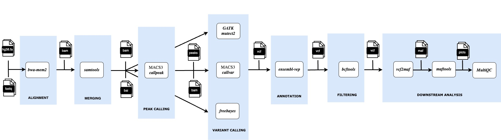

# 🧬 chipcallvar

**chipcallvar** is a reproducible [Nextflow](https://www.nextflow.io/) workflow for calling **somatic variants (SNVs and INDELs)** from **ChIP-seq data**. It supports multiple variant calling tools and is designed for parallel execution, high customizability, and scalability on HPC or cloud environments.

The pipeline integrates the following tools:

1. [MACS3 `callvar`](https://macs3-project.github.io/MACS/docs/callvar.html): peak-aware variant caller optimized for ChIP-seq data
2. [GATK `Mutect2`](https://gatk.broadinstitute.org/hc/en-us/articles/360037593851-Mutect2): industry-standard somatic SNV/INDEL caller
3. [FreeBayes](https://github.com/freebayes/freebayes): haplotype-based variant detection


### Workflow Overview

- Read alignment – `bwa-mem2`, `SamTools`
- Merging technical replicates – `SamTools merge`
- Marking duplicate reads - `GATK MarkDuplicates`
- Base Quality Scores Recalibration - `GATK BaseRecalibrator`, `GATK ApplyBQSR`
- Interval creation – `BedTools`
- Peak calling – `MAC3 CallPeak`
- Variant calling – `MAC3 CallVar`, `GATK Mutect2`, `FreeBayes`
- Variant annotation – `Ensembl VEP`
- Filtering and reheadering – `BcfTools`
- Optional MAF conversion – `vcf2maf`, `maftools`
- Quality control and reporting – `FastQC`, `SamTools`, `Mosdepth`, `BcfTools`, `Ensembl VEP`, summarized with `MultiQC`




To speed up variant calling, the reference genome is split into smaller **genomic intervals** using `bedtools`. Each interval is processed in parallel, and the resulting VCF files are merged. This significantly reduces the total wall-clock time and optimizes the use of compute resources.

---

### 📥 Input

#### Sample Sheet 

Each row describes one replicate of a ChIP-seq experiment. The input format is:

```csv {samplesheet.csv}
id,sample,replicate,fastq_1,fastq_2,control,control_replicate
OCI-AML3,OCI-AML3_input,1,test/hs_ChIP_OCI-AML3_rep1_Input_R1_001.fastq.gz, test/hs_ChIP_OCI-AML3_rep1_Input_R2_001.fastq.gz,,
OCI-AML3,OCI-AML3_H3K27ac,1,test/hs_ChIP_OCI-AML3_rep1_H3K27ac_R1_001.fastq.gz,test/hs_ChIP_OCI-AML3_rep1_H3K27ac_R2_001.fastq.gz,OCI-AML3_input,1
OCI-AML3,OCI-AML3_H3K27ac,2,test/hs_ChIP_OCI-AML3_rep2_H3K27ac_R1_001.fastq.gz,test/hs_ChIP_OCI-AML3_rep2_H3K27ac_R2_001.fastq.gz,OCI-AML3_input,1
```

```csv {samplesheet.csv}
id,sample,vcf,caller
24_F,SA10,SA10_peaks.vcf,macs3
85_M,SA11,SA11_peaks.vcf,macs3
```

#### ⚙️ Parameters File 
step can be 'mapping', 'annotate'


```yaml {params.yaml}
outdir: './results'
samplesheet: './samplesheet_example.csv'
# reference genome
fasta: './resources-broad-hg38-v0-Homo_sapiens_assembly38.fasta'
fasta_fai: './resources-broad-hg38-v0-Homo_sapiens_assembly38.fasta.fai'
assembly: 'GRCh38'
step: 'mapping'
tools: 'macs3,mutect2,freebayes'
skip_tools: 'dge,markduplicates,bqsr'
no_intervals: TRUE
merge_vcfs: TRUE
# variant filtering
depth: 10
vaf: 0.1
af1: 0.0001
af2: 0.0001
# for DGE analysis
tpm: './nf-rnaseq/star_rsem/rsem.merged.gene_tpm.tsv'
email: 'example@gmail.com'
```

### 🚀 Running the Pipeline

```bash
nextflow run main.nf -params-file params.yaml 
```

---

## 👩‍💻 Author

Ann Mariya
[GitHub](https://github.com/annmariyaes)
[Email](annmariya.elayani@gmail.com)
