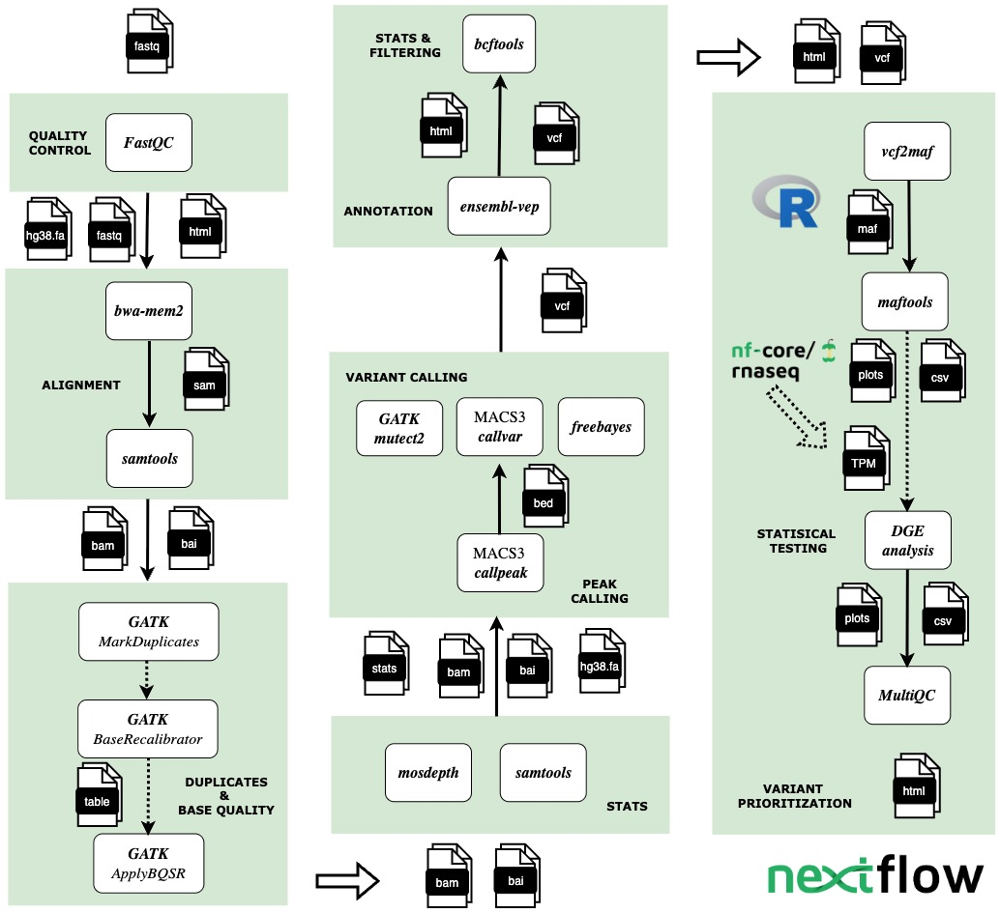

# 🧬 chipcallvar

**chipcallvar** is a reproducible [Nextflow](https://www.nextflow.io/) workflow for calling **somatic variants (SNVs and INDELs)** from **ChIP-seq data**. It supports multiple variant calling tools and is designed for parallel execution, high customizability, and scalability on HPC or cloud environments.

The pipeline integrates the following tools:

1. [MACS3 `callvar`](https://macs3-project.github.io/MACS/docs/callvar.html): peak-aware variant caller optimized for ChIP-seq data
2. [GATK `Mutect2`](https://gatk.broadinstitute.org/hc/en-us/articles/360037593851-Mutect2): industry-standard somatic SNV/INDEL caller
3. [FreeBayes](https://github.com/freebayes/freebayes): haplotype-based variant detection


### Workflow Overview

- Read alignment and deduplication – `bwa-mem2`, `samtools`
- Merging technical replicates – `samtools merge`
- Interval creation – `bedtools`
- Peak calling – `macs3 callpeak`
- Variant calling – `macs3 callvar`, `GATK Mutect2`, `FreeBayes`
- Variant annotation – `Ensembl VEP`
- Filtering and reheadering – `bcftools`
- Optional MAF conversion – `vcf2maf`, `maftools`
- Quality control and reporting – `FastQC`, `Samtools`, `Mosdepth`, `bcftools`, `Ensembl VEP`, summarized with `MultiQC`




To speed up variant calling, the reference genome is split into smaller **genomic intervals** using `bedtools`. Each interval is processed in parallel, and the resulting VCF files are merged. This significantly reduces the total wall-clock time and optimizes the use of compute resources.

---

### 📥 Input

#### Sample Sheet (`samplesheet.csv`)

Each row describes one replicate of a ChIP-seq experiment. The input format is:

```csv
patient,sample,replicate,fastq_1,fastq_2,control,control_replicate
OCI-AML3,OCI-AML3_input,1,test/hs_ChIP_OCI-AML3_rep1_Input_R1_001.fastq.gztest/hs_ChIP_OCI-AML3_rep1_Input_R2_001.fastq.gz,,
OCI-AML3,OCI-AML3_H3K27ac,1,test/hs_ChIP_OCI-AML3_rep1_H3K27ac_R1_001.fastq.gz,test/hs_ChIP_OCI-AML3_rep1_H3K27ac_R2_001.fastq.gz,OCI-AML3_input,1
OCI-AML3,OCI-AML3_H3K27ac,2,test/hs_ChIP_OCI-AML3_rep2_H3K27ac_R1_001.fastq.gz,test/hs_ChIP_OCI-AML3_rep2_H3K27ac_R2_001.fastq.gz,OCI-AML3_input,1
```

#### ⚙️ Parameters File (params.yaml)
```yaml
samplesheet: './samplesheet_example.csv'
outdir: "./nf-macs3"
fasta: './reference/resources-broad-hg38-v0-Homo_sapiens_assembly38.fasta'
fai: './reference/resources-broad-hg38-v0-Homo_sapiens_assembly38.fasta.fai'
dict: './reference/resources-broad-hg38-v0-Homo_sapiens_assembly38.dict'
assembly: 'GRCh38'
genome_size: 'hs'
step: 'mapping'
tools: 'macs3,mutect2,freebayes'
email: 'example@gmail.com'
```

### 🚀 Running the Pipeline

```bash
nextflow run main.nf -params-file params.yaml 
```

---

## 👩‍💻 Author

Ann Mariya
[GitHub](https://github.com/annmariyaes)
[Email](annmariya.elayani@gmail.com)
